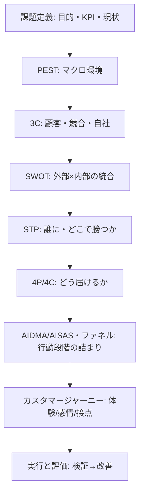
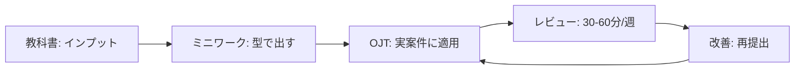
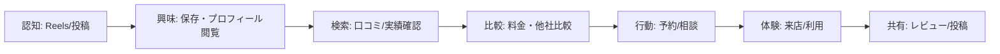

# 専属の未経験新人を実務で戦力化するためのマーケティング教科書設計レポート

## エグゼクティブサマリー

本レポートは、**「専属の未経験新人（新入社員）」を、現場課題に対して主要フレームワークを適切な用途・順序で適用できる状態**へ育成するための、実務特化型「日本語教科書」設計案である。核となる方針は、①マーケティングの定義（2024年改訂）を“実務で使える言葉”へ翻訳して腹落ちさせる、②フレームワークを「暗記」ではなく「考え漏れ防止・共通言語化の道具」として教える、③**環境分析→STP→4P→実行と評価**という基本プロセスに沿って、毎章ミニワークで“当てはめて出す”ことを徹底する、の3点である（日本マーケティング協会, https://www.jma-jp.org/info/news/916-marketing）（グロービス経営大学院, https://mba.globis.ac.jp/about_mba/glossary/detail-12000.html）。citeturn1view0turn11view1

事実検証の結論として、(1) **日本マーケティング協会（JMA）のマーケティング定義は2024/01/25に刷新**され、定義本文も一次情報で確認できる（日本マーケティング協会, https://www.jma-jp.org/info/news/916-marketing）。citeturn1view0  
(2) **AISASは「2004年から電通が提唱」**と電通のニュースリリースPDF（一次）に明記があり、2005年説は二次情報としての表記揺れである（電通, https://www.dentsu.co.jp/news/release/pdf-cms/2011009-0131.pdf）。citeturn11view0turn3search3  
(3) フレームワーク順序は「唯一の正解」が一次資料で固定されているわけではないが、**環境分析でPEST/3C/SWOTを用い、その後STP→4P→評価**へ進む流れは、ビジネススクール系教材で明示されている（グロービス経営大学院, https://mba.globis.ac.jp/knowledge/detail-21445.html）（グロービス経営大学院, https://mba.globis.ac.jp/about_mba/glossary/detail-12000.html）。citeturn12view0turn11view1  
(4) 章ごとのページ/時間配分は一次資料で“正解”が存在しないため、本レポートでは**中小企業の育成実態（育成期間が企業によりばらつく、OJT中心が多数）**を参照しつつ、現実的な研修設計として提案する（中小企業庁（中小企業白書2024）, https://www.chusho.meti.go.jp/pamflet/hakusyo/2024/PDF/chusho/04Hakusyo_part2_chap1_web.pdf）。citeturn13view0

---

## 事実検証と出典方針

### 出典方針（一次優先の序列）

本レポートは、一次/準一次を優先して根拠付けする。主要に参照した一次・準一次の公的/企業研修系ソースは以下である（URLは要求仕様に従い明記）。

- entity["organization","公益社団法人日本マーケティング協会","japan marketing association"]：2024年の定義改訂リリース（日本マーケティング協会, https://www.jma-jp.org/info/news/916-marketing）。citeturn1view0  
- entity["company","株式会社電通","japanese advertising company"]：AISASに言及するニュースリリースPDF（電通, https://www.dentsu.co.jp/news/release/pdf-cms/2011009-0131.pdf）。citeturn11view0  
- entity["organization","中小企業庁","japan sme agency"]：中小企業白書（OJT/OFF-JT定義、育成期間の分布など）（中小企業庁, https://www.chusho.meti.go.jp/pamflet/hakusyo/2024/PDF/chusho/04Hakusyo_part2_chap1_web.pdf）。citeturn13view0  
- entity["organization","独立行政法人中小企業基盤整備機構","smrj japan"]／entity["organization","J-Net21","smrj business support site"]：4P・SWOT・4C等の実務解説（例：4P/4C, https://seisansei.smrj.go.jp/problem_solving/comics/marketing-4p.html）（4P/4C別記事, https://j-net21.smrj.go.jp/solution/handbook/development/feasibility.html）（SWOT, https://j-net21.smrj.go.jp/mangadewakaru/01.html）。citeturn11view2turn11view3turn11view4  
- entity["organization","グロービス経営大学院","japan business school"]：マーケティング・プロセス、3C/SWOT/PEST/カスタマージャーニー等の定義・プロセス提示（例：マーケティング・プロセス, https://mba.globis.ac.jp/about_mba/glossary/detail-12000.html）（戦略立案の流れ, https://mba.globis.ac.jp/knowledge/detail-21445.html）。citeturn11view1turn12view0  
- entity["organization","文部科学省","japan ministry of education"]：教育目標分類（ブルーム・タキソノミーの言及を含む補足資料PDF）（文部科学省, https://www.mext.go.jp/b_menu/shingi/chukyo/chukyo3/053/siryo/__icsFiles/afieldfile/2015/05/25/1358029_02_1.pdf）。citeturn10search3  

加えて、ファネル実務解説として entity["company","SATORI株式会社","marketing automation company japan"]（SATORI, https://satori.marketing/marketing-blog/what_is_funnel/）、AIDMA起源の説明として entity["organization","一般社団法人ウェブ解析士協会","web analytics association japan"]（WACA, https://www.waca.or.jp/knowledge/52580/）を補助的に用いた。citeturn11view5turn14view0

### 既存ドラフトの主要主張の検証結果

| 検証対象の主張 | 一次資料で支持されるか | 判定 | 修正・補足（出典） |
|---|---|---|---|
| 「JMAが2024年にマーケティング定義を刷新」 | 支持される | ✅支持 | 2024/01/25のリリースで刷新と定義本文が明記（日本マーケティング協会, https://www.jma-jp.org/info/news/916-marketing）。citeturn1view0 |
| 「新定義の本文（価値共創〜持続可能な社会…）」 | 支持される | ✅支持 | 定義本文が一次で掲載（同上）。citeturn1view0 |
| 「AISASは電通が2004年に提唱（資料により2005表記もある）」 | 支持は“2004”に強い | ⚠️要修正 | 電通一次資料で「2004年からAISASを提唱」と明記（電通, https://www.dentsu.co.jp/news/release/pdf-cms/2011009-0131.pdf）。2005表記は二次資料の揺れとして注記（例：https://www.gon-dola.com/lift/marketing-general/4941/）。citeturn11view0turn3search3 |
| 「推奨フレームワーク順序：PEST→3C→SWOT→STP→4P→評価」 | “大枠”は支持、細順序は設計判断 | ⚠️部分支持 | 環境分析でPEST/3C/SWOTを行い、その後STP-4Pへ進む流れは教材で明示（グロービス経営大学院, https://mba.globis.ac.jp/knowledge/detail-21445.html）。一方、PEST→3C→SWOTの厳密な順序は一次で固定されないため、教科書上は「推奨順序（理由付き）」として提示するのが正確。citeturn12view0 |
| 「章ごとの時間配分（例：各章2〜4h）」 | 一次資料で“正解”なし | ❌一次で検証不可 | 時間配分は教材設計上の提案値。中小企業の育成はOJT中心が多く、育成期間も企業差が大きいデータがあるため（中小企業白書2024）、これを踏まえて現実的な提案として提示する（中小企業庁, https://www.chusho.meti.go.jp/pamflet/hakusyo/2024/PDF/chusho/04Hakusyo_part2_chap1_web.pdf）。citeturn13view0 |

---

## 対象読者プロファイルと到達目標

### 対象読者ペルソナ（未経験・専属）

前提：**中小企業環境**（リソース制約、指導者不足が起こりやすい）を想定する。これは中小企業白書で「指導する人材の不足」「育成にかける時間がない」等が課題上位として示されていることとも整合する（中小企業庁, https://www.chusho.meti.go.jp/pamflet/hakusyo/2024/PDF/chusho/04Hakusyo_part2_chap1_web.pdf）。citeturn13view0

| 項目 | 内容 |
|---|---|
| 役割 | 専属マーケ担当（他部門兼務なし）。未経験の新入社員。※年齢/学歴/専攻：未指定 |
| 想定スキル | 基本的なPC操作、文書作成、表計算の初歩。対人コミュニケーションは平均的。※データ分析/広告運用/SEO/制作経験：未指定 |
| 想定知識 | マーケ用語はほぼ未習得。「マーケ=広告/SNS」の誤解が起こりやすい（J-Net21でも同様の誤解が言及される）（J-Net21, https://seisansei.smrj.go.jp/problem_solving/comics/marketing-4p.html）。citeturn11view2 |
| 業務環境 | 上司/先輩のレビュー時間は限定的（週30〜60分程度を想定：未指定のため提案値）。施策実行（SNS投稿、LP/サイト改善、簡易レポート）は本人が手を動かす必要がある |
| 重要な制約 | 「施策先行」になりやすい／情報源の真偽を見分けにくい／フレームワークを“埋めること”が目的化しやすい（後述の教材設計で抑止） |

### 測定可能な到達目標と評価基準（行動で観測できる形）

学習目標は「知識→理解→応用…」の段階で観測可能にする設計が推奨される（ブルーム・タキソノミーの枠組み言及を含む資料）（文部科学省, https://www.mext.go.jp/b_menu/shingi/chukyo/chukyo3/053/siryo/__icsFiles/afieldfile/2015/05/25/1358029_02_1.pdf）。citeturn10search3

| 到達目標カテゴリ | 測定可能な到達目標（例） | 観測できる評価基準（何を見れば合格か） |
|---|---|---|
| 説明能力 | マーケティングを、2024年JMA定義の要旨（価値共創・浸透・関係性・社会）を踏まえ、営業/広告/制作との違いも含めて3分で説明できる（日本マーケティング協会, https://www.jma-jp.org/info/news/916-marketing）。citeturn1view0 | (1) 定義要素が欠けない (2) 手段（広告等）と目的（価値浸透等）を混同しない (3) 例え話が適切（自社案件に接続） |
| フレームワーク選択 | 与えられた課題に対し、環境分析（PEST/3C/SWOT）→STP→4P→評価のどこが不足かを判断し、使うフレームワークを理由付きで選択できる（グロービス経営大学院, https://mba.globis.ac.jp/knowledge/detail-21445.html）（グロービス経営大学院, https://mba.globis.ac.jp/about_mba/glossary/detail-12000.html）。citeturn12view0turn11view1 | (1) 目的に対し過不足ない選択 (2) 順序の理由が説明できる (3) “全部やる”ではなく論点から逆算できる |
| アウトプット能力 | A4 1〜3枚で「現状→論点→仮説→施策→指標」を構造化し提出できる（章末成果物の提出） | (1) 事実と解釈が分離 (2) STPと4Pの整合 (3) KPIが施策と因果で結びつく |
| 検証能力 | 2週間の小さな検証計画を作成し、実行後に“学び”を次の仮説へ接続できる（評価設計は4段階で捉えると運用しやすい）（カークパトリックモデル解説, https://achievement-hrs.co.jp/ritori/kirkpatrick-model/）。citeturn10search0 | (1) 仮説が1文で明確 (2) 事前に判定条件が定義 (3) 結果→解釈→次アクションが一貫 |

---

## 教科書の全体設計と章立て

### 教科書の背骨（順序設計）

教科書の章順は、マーケティング・プロセス（環境分析→STP→4P→実行と評価）に沿わせる。これは、グロービスの用語集で6ステップとして整理され、別ページでも戦略立案の流れが説明されている（グロービス経営大学院, https://mba.globis.ac.jp/about_mba/glossary/detail-12000.html）（グロービス経営大学院, https://mba.globis.ac.jp/knowledge/detail-21445.html）。citeturn11view1turn12view0

また「4Pの前に、誰に売るか（STP）が必要」という点は、同系統教材で明確に述べられている（GLOBIS知見録, https://globis.jp/article/1593/）。citeturn15view0

#### 推奨：フレームワーク関係図（mermaid）

（環境分析でPEST/3C/SWOTを用いること、STP-4Pの枠組みが示されることは教材で明記）（グロービス経営大学院, https://mba.globis.ac.jp/knowledge/detail-21445.html）。citeturn12view0

### 目次（推奨）と章別到達目標・配分

ページ数/研修時間は**提案値**である。中小企業ではOJT中心の育成が多く、採用後に「一人で通常業務をこなせるまで」の育成期間は企業差が大きい（新卒は“定めていない”回答も多い）ため、教科書学習（Off-JT）を過度に長くせず、OJT反復に接続する配分とする（中小企業庁, https://www.chusho.meti.go.jp/pamflet/hakusyo/2024/PDF/chusho/04Hakusyo_part2_chap1_web.pdf）。citeturn13view0

| 章番号 | 章タイトル | 到達目標 | 章末成果物 | 推奨ページ | 推奨研修時間 |
|---:|---|---|---|---:|---:|
| 1 | マーケティングの定義と職務範囲 | 2024年JMA定義の要旨を踏まえ、営業・広告・制作との違いを説明できる（日本マーケティング協会, https://www.jma-jp.org/info/news/916-marketing）。citeturn1view0 | 「マーケ全体像1枚図」 | 10 | 2.0h |
| 2 | 課題定義の型 | 目的→KPI→現状→論点→仮説をA4 1枚に落とせる（戦略立案でKPI設計と検証が重要と説明）（グロービス経営大学院, https://mba.globis.ac.jp/knowledge/detail-21445.html）。citeturn12view0 | 「課題定義シート」 | 14 | 3.0h |
| 3 | 環境分析Ⅰ：PESTと3C | PEST/3Cで外部・内部の材料を集め、見落としを減らせる（環境分析でPEST/3Cを行う例示）（グロービス経営大学院, https://mba.globis.ac.jp/knowledge/detail-21445.html）。citeturn12view0 | 「PEST/3Cシート」 | 22 | 4.0h |
| 4 | 環境分析Ⅱ：SWOTで論点化 | SWOTで外部/内部を統合し、戦略論点を抽出できる（J-Net21 SWOT解説, https://j-net21.smrj.go.jp/mangadewakaru/01.html）。citeturn11view4 | 「SWOT→論点3つ」 | 14 | 3.0h |
| 5 | STP：誰に・どこで勝つか | STPで「誰に」を明確化し、4P前提を作れる（STP→マーケミックスの順が重要）（GLOBIS, https://globis.jp/article/1593/）。citeturn15view0 | 「STP 1枚」 | 18 | 3.5h |
| 6 | 4P/4C：どう届けるか | 4Pを設計し、4Cで顧客視点に翻訳できる（4P/4Cの定義と対応表）（J-Net21, https://j-net21.smrj.go.jp/solution/handbook/development/feasibility.html）。citeturn11view3 | 「4P/4C設計図」 | 18 | 3.5h |
| 7 | 行動モデル：AIDMA/AISAS・ファネル・CJM | ファネルで詰まり特定→CJMで接点/感情まで落とし、施策とKPIを置ける（ファネル基本段階）（SATORI, https://satori.marketing/marketing-blog/what_is_funnel/）（CJM定義）（グロービス, https://mba.globis.ac.jp/about_mba/glossary/detail-24425.html）。citeturn11view5turn8search3 | 「ファネル＋CJM」 | 26 | 5.0h |
| 8 | 実行・評価：小さく検証して学ぶ | 2週間の検証計画を作り、結果を次の仮説へ接続できる（実行と評価がプロセスに含まれる）（グロービス, https://mba.globis.ac.jp/about_mba/glossary/detail-12000.html）。citeturn11view1 | 「検証計画＋週次レポ雛形」 | 18 | 4.0h |

#### 推奨：学習フロー（mermaid）

OJTとOFF-JTの区別は、中小企業白書等で定義が示されている（中小企業白書2018, https://www.chusho.meti.go.jp/pamflet/hakusyo/H30/h30/html/b2_3_3_1.html）。citeturn0search3

### 各章ミニワーク（設問＋模範解答）と推奨図解

| 章 | ミニワーク（設問） | 模範解答（要点） | 推奨図解（例） |
|---:|---|---|---|
| 1 | 「マーケ=広告」と言う同僚に3分で説明する台本を作れ | 2024定義の要素（価値共創→浸透→関係性→社会）→広告は手段の一部→目的は仕組み設計、の順で説明（日本マーケティング協会, https://www.jma-jp.org/info/news/916-marketing）。citeturn1view0 | 「目的・手段」マップ |
| 2 | 地域整体院：問い合わせが減少。目的/KPI/仮説をA4 1枚に | 目的＝有効問い合わせ増、KPI＝CV/CVR/CPA等、仮説＝検索意図ズレor導線摩擦。施策は後段（グロービスでKPI設計と検証の重要性が説明）（グロービス, https://mba.globis.ac.jp/knowledge/detail-21445.html）。citeturn12view0 | KPIツリー（目的→中間指標→行動） |
| 3 | 同整体院：PESTと3Cを各5項目で埋めよ | PESTは政治/経済/社会/技術の変化、3Cは顧客・競合・自社。環境分析でPEST/3Cを行う流れを踏襲（グロービス, https://mba.globis.ac.jp/knowledge/detail-21445.html）。citeturn12view0 | PEST表 + 3C三分割図 |
| 4 | 第3章をSWOTに統合し、論点を3つ抽出せよ | SWOTは強み/弱み/機会/脅威で整理し、戦略方針明確化に繋げる（J-Net21, https://j-net21.smrj.go.jp/mangadewakaru/01.html）。citeturn11view4 | SWOTマトリクス＋論点欄 |
| 5 | 士業：STPを作り「ポジショニング文」を1行で | STPで「誰に」を定め、マーケミックス前提を作る（GLOBIS, https://globis.jp/article/1593/）。citeturn15view0 | ポジショニングマップ（2軸） |
| 6 | 上記：4Pを書き、4Cで顧客視点へ翻訳 | 4P（Product/Price/Place/Promotion）と4C（価値/コスト/利便/コミュニケーション）に対応（J-Net21, https://j-net21.smrj.go.jp/solution/handbook/development/feasibility.html）。citeturn11view3 | 4P⇔4C対応表 |
| 7 | Instagram運用：ファネルで詰まり→CJMで接点・感情→施策配置 | ファネル基本段階（認知→興味→比較→購入）で詰まり特定（SATORI, https://satori.marketing/marketing-blog/what_is_funnel/）。CJMは行動と感情の変化と接点を捉える（グロービス, https://mba.globis.ac.jp/about_mba/glossary/detail-24425.html）。citeturn11view5turn8search3 | ファネル×CJMのマトリクス |
| 8 | 2週間の改善実験計画（仮説/施策/指標/判定）を作れ | 仮説1つに対し実験1つ、判定条件を事前定義。実行と評価をプロセスに含める（グロービス, https://mba.globis.ac.jp/about_mba/glossary/detail-12000.html）。citeturn11view1 | 実験設計シート（A/B含む） |

---

## フレームワーク比較表

**自社想定（簡易例の前提）**：未指定のため、一般的な中小企業環境として「地域事業者向けに、SEO/MEO/広告/Instagram/LP改善の運用支援を月額で提供する会社」を仮定する（仮定であり事実主張ではない）。

| フレームワーク | 何を整理するか | 使う場面 | 構成要素 | 記入例（自社想定の簡易例） | 注意点 |
|---|---|---|---|---|---|
| 3C | 事業環境を「市場/顧客・競合・自社」で整理 | 戦略の出発点、KSF探索 | Customer / Competitor / Company | C：地域店舗は「人手不足で集客が回らない」 Co：同業は「格安制作」訴求が多い 自社：MEO×LP×広告を一気通貫 | 顧客（市場）起点が中心とされる（グロービス, https://mba.globis.ac.jp/about_mba/glossary/detail-12524.html）。citeturn7search0 |
| SWOT | 外部（機会/脅威）×内部（強み/弱み）で統合し論点化 | 現状整理→戦略方針 | S/W/O/T | S：改善事例が豊富 W：運用人員が少ない O：地域DX需要増 T：内製化ツール普及 | 内部/外部の混同を避ける（J-Net21, https://j-net21.smrj.go.jp/mangadewakaru/01.html）。citeturn11view4 |
| STP | 「誰に」「どこで勝つか」を定義 | 4P前提、訴求軸決定 | Segmentation / Targeting / Positioning | S：業種×地域×課題で分ける T：半径5kmの美容室 P：予約増に強いMEO+導線 | 4Pの前にSTPが必要（GLOBIS, https://globis.jp/article/1593/）。citeturn15view0 |
| 4P/4C | 施策設計（企業視点）と顧客視点への翻訳 | STP確定後の実行計画 | 4P：Product/Price/Place/Promotion 4C：価値/コスト/利便/コミュニケーション | 4P：月額運用パック、10万円〜、オンライン中心、事例LPで獲得 4C：価値=集客不安軽減、コスト=費用+工数、利便=丸投げ設計、対話=月次レポ | 4Pと4Cの対応関係が整理されている（J-Net21, https://j-net21.smrj.go.jp/solution/handbook/development/feasibility.html）（4P漫画内の4C対応表, https://seisansei.smrj.go.jp/problem_solving/comics/marketing-4p.html）。citeturn11view3turn11view2 |
| PEST | コントロール不能なマクロ外部要因を整理 | 環境変化の機会/脅威探索 | Politics / Economy / Society / Technology | E：広告単価上昇 S：口コミ重視の強まり T：AIで制作内製化 | マクロ環境分析でPESTを用いる（グロービス, https://mba.globis.ac.jp/about_mba/glossary/detail-12009.html）。citeturn7search3 |
| AIDMA / AISAS | 購買・情報行動を段階で捉え、施策配置 | 施策の抜け漏れ点検 | AIDMA：A→I→D→M→A AISAS：A→I→S→A→S | AISAS例：広告で認知→興味→検索→申込→レビュー共有 | AISASは電通一次資料で「2004年から提唱」と明記（電通, https://www.dentsu.co.jp/news/release/pdf-cms/2011009-0131.pdf）。AIDMA起源は1920年代提唱とする説明がある（WACA, https://www.waca.or.jp/knowledge/52580/）。年表記（AISAS=2005等）は二次で揺れがあるため脚注で扱う。citeturn11view0turn14view0turn3search3 |
| カスタマージャーニー | 顧客体験（行動＋感情＋接点）を俯瞰 | 体験設計/導線/コンテンツ設計 | フェーズ×（行動/感情/接点/課題） | 認知：不安「信頼できる？」→実績/口コミ 比較：疑問「料金は？」→FAQ | 顧客行動と感情の変化を理解する手法として定義（グロービス, https://mba.globis.ac.jp/about_mba/glossary/detail-24425.html）。citeturn8search3 |
| ファネル | 段階別の人数と“詰まり”を特定 | CV改善、KPI設計 | 認知→興味→比較→購入（基本） | PV 10,000→LP 2,000→CV 40（CVR2%） 詰まり：LP→CV | 基本段階の提示と、現代行動への限界/併用（CJM等）への言及がある（SATORI, https://satori.marketing/marketing-blog/what_is_funnel/）。citeturn11view5 |

---

## ケーススタディ集

各ケースは、**「状況→問題→仮説→施策→期待指標→学び」**で統一し、フレームワーク適用の“出力型”訓練にする。ファネルは詰まり特定、CJMは接点・感情を含む設計に強く、併用が合理的である（SATORI, https://satori.marketing/marketing-blog/what_is_funnel/）（グロービス, https://mba.globis.ac.jp/about_mba/glossary/detail-24425.html）。citeturn11view5turn8search3

| ケース | 状況 | 問題 | 仮説 | 施策（フレームワーク接続） | 期待指標 | 学び |
|---|---|---|---|---|---|---|
| 飲食店 | 平日夜の予約が弱い | 表示はあるのに予約に繋がらない | ターゲット不明で比較負け | 3Cで競合訴求→STPで「仕事帰り少人数」→4Pでコース設計→ファネルで予約導線改善 | 予約数、予約クリック率、来店単価 | 「誰に」を決めるとメニュー/訴求/導線が一貫する（STP→4Pの順が重要）（GLOBIS, https://globis.jp/article/1593/）。citeturn15view0 |
| 士業 | 問合せはあるが成約率低い | ミスマッチ案件が多い | ターゲット広すぎ／期待値ズレ | STPで業種/規模を絞る→4Cで顧客負担（書類/手間）を下げる→CJMで不安点をFAQ化 | 有効問合せ率、面談化率、成約率 | “数”より“質”でKPI設計（評価・検証の重要性）（グロービス, https://mba.globis.ac.jp/knowledge/detail-21445.html）。citeturn12view0 |
| 地域店舗 | 来店が季節でブレる | MEOはやっているが順位不安定 | 情報鮮度不足、検索意図不一致 | PESTで季節要因→3Cで検索意図→投稿/写真更新→レビュー導線→ファネルで「検索→行動」追跡 | ルート検索、電話、行動率、レビュー数 | まず「計測できる行動」を定義し段階別に改善（ファネルの用途）（SATORI, https://satori.marketing/marketing-blog/what_is_funnel/）。citeturn11view5 |
| Instagram運用 | フォロワー増も売上が弱い | 興味→比較/購入が弱い | 次の導線が不十分 | AISASでSearch/Action導線→CJMで不安抽出→LP/ハイライト整備→4P/4Cでオファー再設計 | プロフ遷移率、リンククリック、CV/CVR | 行動モデルは施策配置に有効（AISASは2004年から提唱）（電通, https://www.dentsu.co.jp/news/release/pdf-cms/2011009-0131.pdf）。citeturn11view0 |
| LP改善 | CVR低下でCPA上昇 | 流入は維持もCV減 | 訴求ズレ/フォーム摩擦/証拠不足 | ファネルで詰まり→3Cで競合訴求→STP再確認→4Cで不安解消→小さくA/B検証計画 | CVR、到達率、完了率、CPA | 実行前に目的と期待効果を見積もり、実行後に検証することが重要（グロービス, https://mba.globis.ac.jp/knowledge/detail-21445.html）。citeturn12view0 |

### 推奨：カスタマージャーニー例（Instagram運用の簡易版・mermaid）

カスタマージャーニーは「認知→購入→使用」までの行動と感情変化を理解する手法として整理される（グロービス, https://mba.globis.ac.jp/about_mba/glossary/detail-24425.html）。citeturn8search3

---

## 研修運用と評価設計

### 推奨指導シーケンス（6週間）と短期ブートキャンプ（2週間）

中小企業では「OJT中心」が多い一方、指導者不足や育成時間不足が課題になりやすい（中小企業庁, https://www.chusho.meti.go.jp/pamflet/hakusyo/2024/PDF/chusho/04Hakusyo_part2_chap1_web.pdf）。そのため、**Off-JT（本教科書）で“型”を短期で作り、OJTで反復**する設計が現実的である。citeturn13view0

#### 6週間モデル（週1回の集合＋自習＋OJT適用）

| 週 | 重点章 | セッション設計（例） | 提出物（チェックポイント） |
|---:|---|---|---|
| 1 | 1〜2 | 定義→課題定義の型→小演習 | CP0：用語ミニテスト＋課題定義シート |
| 2 | 3 | PEST/3Cの書き方→実案件に当てる | CP1：PEST/3C（A4各1枚） |
| 3 | 4 | SWOTで論点抽出→優先順位づけ | SWOT→論点3つ |
| 4 | 5〜6 | STP→4P/4Cで施策設計図 | CP2：STP＋4P/4C |
| 5 | 7 | ファネルで詰まり→CJMで施策配置 | ファネル＋CJM |
| 6 | 8 | 2週間検証計画→週次レポ雛形 | CP3：検証計画＋週次レポ |

#### 2週間ブートキャンプ（短期集中・導入向け）

| 日程 | 午前（講義＋例示） | 午後（演習＋レビュー） | 宿題 |
|---:|---|---|---|
| Day1 | 章1：定義と職務範囲 | ミニワーク1 | 章2読む |
| Day2 | 章2：課題定義 | ミニワーク2 | 課題定義シート |
| Day3 | 章3：PEST | PEST演習 | 3C下書き |
| Day4 | 章3：3C | 3C演習 | PEST/3C提出 |
| Day5 | 章4：SWOT | SWOT→論点 | 論点3つ提出 |
| Day6 | 章5：STP | STP演習 | STP提出 |
| Day7 | 章6：4P/4C | 4P/4C演習 | 4P/4C提出 |
| Day8 | 章7：ファネル | 詰まり特定演習 | ファネル提出 |
| Day9 | 章7：CJM | CJM→施策配置 | CJM提出 |
| Day10 | 章8：検証計画 | 最終発表 | 2週間実験開始 |

（OJT/OFF-JTの定義と位置づけは白書で整理）（中小企業白書2018, https://www.chusho.meti.go.jp/pamflet/hakusyo/H30/h30/html/b2_3_3_1.html）。citeturn0search3

### 評価チェックポイント（提出物）と評価枠組み

研修の評価は「反応・学習・行動・結果」の4段階で捉える枠組みが知られ、学習（テスト）だけでなく行動変容まで見に行く設計が推奨される（アチーブメントHRソリューションズ, https://achievement-hrs.co.jp/ritori/kirkpatrick-model/）。citeturn10search0

| チェックポイント | 評価段階（例） | 目的 | 提出物 | 合格条件（要約） |
|---|---|---|---|---|
| CP0（開始） | 学習 | 誤解と初期値把握 | 用語ミニテスト/自己評価 | “マーケ=広告”等の誤解が言語化できる |
| CP1（Week2） | 学習→行動 | 分析の型定着 | PEST/3C（A4各1枚） | 事実/解釈が分離され、抜け漏れが少ない |
| CP2（Week4） | 行動 | 戦略→施策接続 | STP＋4P/4C（2〜3枚） | STPと4Pが整合し、顧客視点へ翻訳できる |
| CP3（Week6） | 行動→結果 | 検証で学びを回す | 検証計画＋週次レポ | 指標・判定条件が明確で、次仮説が書ける |

### ルーブリック（4段階：未到達/基礎/実務可/自走）

| 観点 | 未到達 | 基礎 | 実務可 | 自走 |
|---|---|---|---|---|
| 課題定義（目的→KPI→仮説） | 施策先行で論点が曖昧 | 目的とKPIが部分的 | 目的/KPI/仮説が整合 | 代替KPIや優先度まで提案 |
| フレームワーク選択と順序 | 乱用/順序なし | 使うが順序が不安定 | 環境分析→STP→4P→評価の筋を守る（グロービスの流れ参照, https://mba.globis.ac.jp/knowledge/detail-21445.html）。citeturn12view0 | 課題に応じ最短手順を設計できる |
| 根拠（事実/解釈） | 推測中心 | 一部根拠あり | 根拠で裏付け、解釈を分離 | 根拠の質（一次/計測）まで改善 |
| STP→4P/4C整合 | 矛盾が多い | 一部矛盾 | 一貫したストーリー | 代替ポジション比較まで可能 |
| 検証設計（指標/判定） | 指標が曖昧 | 指標はあるが判定不明 | 判定条件が明確 | 学びを次の仮説へ接続し継続改善 |

---

### 付記：教科書を“更新し続ける”運用（ADDIEの適用）

教科書は固定物ではなく、つまずき箇所を反映して改訂することで費用対効果が上がる。ADDIE（分析→設計→開発→実施→評価）は企業の教育設計での代表モデルとして紹介されている（カオナビ用語集, https://www.kaonavi.jp/dictionary/addie-model/）。citeturn10search1