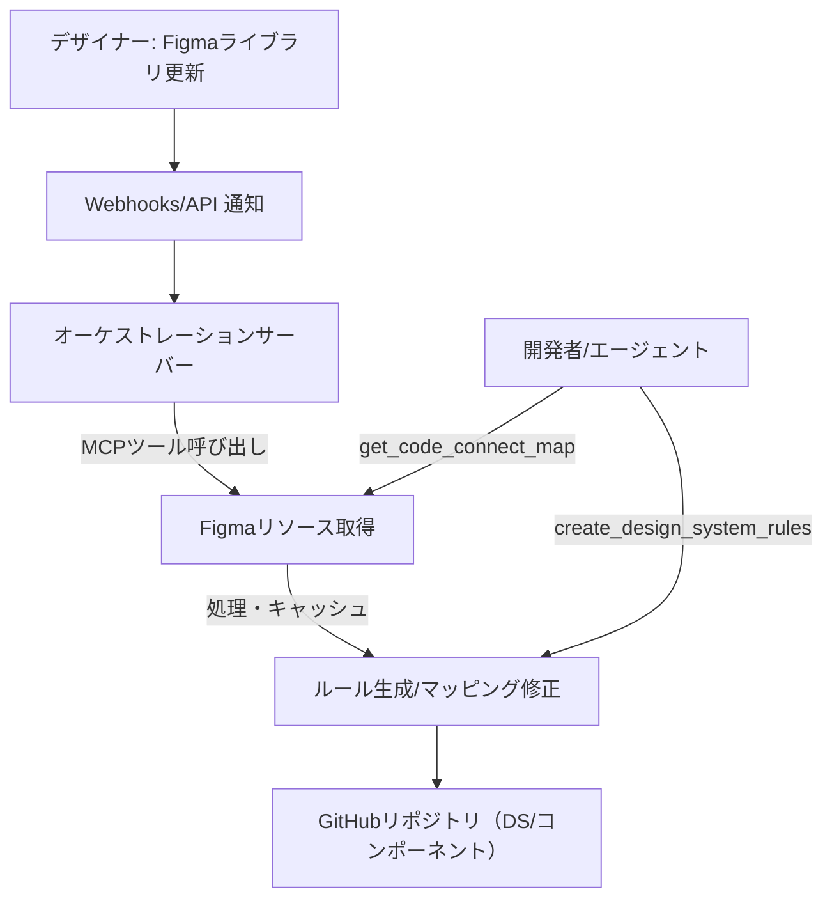
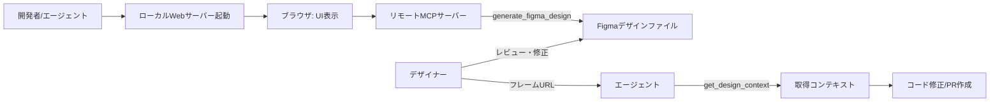

# Figma MCP Server 活用方法に関する技術レポート

## Executive Summary

FigmaのMCP Serverは、AIエージェント（VS Code Copilot、Cursor、Claude Codeなど）に対して、Figma上の設計データ（レイアウト、コンポーネント、変数、FigJam/Makeの情報など）を直接提供し、「デザイン→コード」ワークフローを高速化・正確化するための橋渡し役を担う【1†L73-L80】【8†L81-L89】。具体的には、選択したフレームからコードを生成したり、デザインコンテキスト（色・フォント・間隔などの正確な値やコンポーネント情報）を抽出してIDEに取り込んだり、プロトタイプ（Make）からコード用リソースを取得したりといった機能を提供する【1†L73-L80】【5†L74-L82】。また、Code Connect機能と組み合わせることで、デザインと既存のコンポーネントライブラリを結び付け、生成コードの一貫性を高めることも可能である【1†L80-L83】【21†L1-L4】。

本レポートでは、MCP Serverの機能とユースケースを公式ドキュメントや技術記事をもとに詳細に分析する。具体的には、(1) 提供されるツール・APIの一覧とレスポンス例、(2) 接続モード（リモート/デスクトップ）・認証方式、(3) レート制限・スケーラビリティ、(4) データプライバシー・権限・ガバナンス、(5) 推奨アーキテクチャ（サーバー構成、Webhook/キャッシュ設計）を整理する。さらに、(6) 実装パターンを3つ提示し、それぞれにアーキテクチャ図、擬似コード、コスト・リスク・導入手順の比較表を含める。最後に、短期PoCと中期ロードマップも提示し、導入可否検討に資する洞察を得られるように構成する【1†L73-L80】【8†L81-L89】。

## MCP Serverの概要

FigmaのMCP Serverは、Anthropicらが提唱する**Model Context Protocol**（MCP）の実装の一つであり、AIツールからFigmaのデザインデータへアクセスするための標準化されたインターフェースを提供する【1†L68-L72】【8†L81-L89】。現状、大きく2つの接続モードがある。リモートサーバー方式（`https://mcp.figma.com/mcp`）ではFigmaがホストするエンドポイントにOAuth認証で接続し、デスクトップアプリ不要でどこからでも利用できる【2†L79-L83】【2†L101-L103】。一方、デスクトップサーバー方式（ローカルの`http://127.0.0.1:3845/mcp`）はFigmaデスクトップアプリのDev Modeを有効にすることで起動し、選択範囲ベースでのコンテキスト取得に優れる【3†L109-L112】【4†L145-L148】。いずれの場合も、対応エディタ（VS Code、Cursor、Claude Codeなど）がMCPプロトコルをサポートしている必要がある【2†L66-L70】【17†L111-L118】。

接続後、MCPサーバーはAIエージェントに対して「コード生成」「設計情報取得」「プロトタイプ取込み」「デザインシステム統合」などの一連のツールを公開する【1†L73-L80】【2†L84-L93】。例えば、選択フレームをReact+Tailwindコードに変換したり【4†L118-L127】、使用中のカラーパレットやタイポグラフィ変数を列挙したり【4†L150-L159】、FigJam図をXMLに変換したり【4†L81-L85】、Mermaidからフロー図を生成したり【4†L82-L86】できる。この一連の機能により、図示設計やプロトタイプの情報を欠かさずコード作成に反映できるようになる【5†L68-L76】【6†L65-L73】。

## 目的・ユースケース

### デザイン→実装の自動化・高速化
最も基本的なユースケースは、デザインからの実装速度と精度を上げることである。公式ドキュメントは「選択したフレームをコードへ変換」「変数・コンポーネント・レイアウトデータをIDEへ取り込む」と明記し、デザインシステム対応ワークフローの効率化を例示している【1†L73-L80】【2†L86-L93】。NTT DATAの技術記事でも、Figma MCP ServerとAIコーディングエージェントを組み合わせたReact開発で「初速の大幅向上」「再現精度（体感8〜9割）」が得られたと報告されている【1†L73-L80】【12†L275-L278】。このように、小単位（アトミックコンポーネントや画面）に分けたコンテキスト取得と変換をルール化することで、設計意図を正確に実装でき、デザインとコードのギャップを縮められる。

### デザインシステム・Code Connect連携
Code Connect機能と併用するユースケースも重要である。Code ConnectでデザインのノードIDとコードコンポーネントをマッピングすると、MCP Serverは`<CodeConnectSnippet>`タグ付きの文脈を生成し、UI要素に対応する実装情報を注入できる。公式は「Code Connectにより生成コードをコードベースに整合させる」ことを強調している【1†L80-L83】【21†L1-L4】。また、`get_code_connect_suggestions`や`add_code_connect_map`等のツールで自動マッピング支援やルール生成が可能で、デザインシステムの一貫性確保に寄与する【4†L66-L75】【4†L167-L176】。

### プロトタイプ（Make）からのコード継承
Figma Make（プロトタイプ）との連携も可能で、プロトタイプの設計からコード資源（生成コードやイベントフローなど）を取り出し、プロダクトコードに活用する。Figma公式はこれにより「プロトタイプから本番アプリケーションへの移行が容易になる」と説明している【5†L68-L77】。手順としては、MakeファイルのURLをMCPに渡すとプロジェクト内のファイル一覧が取得され、必要なファイルをダウンロードできる形になる【5†L90-L94】。例えば、ポップアップコンポーネントのふるまいをMCP経由で取り込んで実装に反映する、といった活用が想定される【5†L96-L104】。

### コード→キャンバス往復（レビュー強化）
コードで生成したUIをFigmaに取り込み、デザイナーと一緒にレビュー・調整してからコードに戻す「往復型ワークフロー」も注目される。【6†L65-L73】【6†L81-L86】の通り、`generate_figma_design`ツールを使えば、ブラウザでレンダリングされた画面をFigmaの編集可能なフレームとして取り込める。これにより、従来はスクリーンショットで共有していたUIをFigmaキャンバス上で構造的に比較でき、欠落状態や権限問題など設計の課題発見が容易になる【6†L69-L77】。レビュー後にMCPにフレームURLを渡すとエージェントがコード修正を提案し、設計意図をコードへ反映できる（図式的には「コード→キャンバス→コード」のループ）【6†L81-L86】。GitHub公式情報でも、このcode-to-canvas機能により「VS Codeで実装しながらFigmaにデザインレイヤーを生成する」統合が可能になったと報告されている【6†L81-L86】【2†L84-L93】。

## 機能一覧（取得データ・エンドポイント・レスポンス）

公式ドキュメントに列挙された**MCPツール**と取得データ内容、ならびに関連するFigma REST APIエンドポイントを整理する。

- **generate_figma_design**（選択クライアント・リモートのみ）: ライブUIを新規/既存Figmaファイルやクリップボードへキャプチャする。コードツールではなく、ブラウザ描画画面をそのままFigmaレイヤーへ持ち込む【4†L93-L102】【6†L65-L73】。ツール呼び出しはAPIレート制限から免除され、実行には編集権限が必要。【4†L93-L102】【6†L109-L113】  
- **get_design_context**: FigmaデザインまたはMakeのレイヤーを構造化コンテキストとして取得（デフォルトはReact+Tailwind形式）。出力にはコンポーネント構造、スタイル変数、使用画像のAsset URLなどを含む。デスクトップサーバーでは「現在選択」を指定できるが、リモートでは対象ノードID付きのURLが必要。【4†L118-L127】【4†L145-L148】  
- **get_variable_defs**: Figmaデザインの選択範囲内で使用されている変数（カラー、スペーシング、タイポグラフィなど）とスタイル名・値を列挙して返す【4†L150-L159】。対応するREST APIは `GET /v1/files/:key/variables/local`等であるが、企業版のフル権限ユーザーに限定される点に注意【5†L74-L80】【4†L150-L159】。  
- **get_screenshot**: 選択範囲のピクセル画像（PNG等）を取得。生成コードの検証やデザイナーへの参照用に有用【4†L143-L145】。  
- **get_metadata**: 選択範囲の基本プロパティ（ID、名前、タイプ、位置、サイズなど）を含む疎なXMLを返す【4†L77-L81】【4†L147-L154】。大きなレイアウトでトークン消費を抑えたい場合に推奨される。  
- **get_figjam**: FigJam図をXML形式で取得し、ノードごとのスクリーンショットも含める【4†L81-L85】。フローチャートやアーキテクチャ図の読み込みに対応。  
- **generate_diagram**: Mermaid構文からFigJamの図（フロー、ガントチャート、シーケンスなど）を生成【4†L82-L86】。アーキテクチャ設計の自動ビジュアル化などに使える。  
- **get_code_connect_map**/**add_code_connect_map**: FigmaノードIDとコードコンポーネント（パスや名前）の対応マップを取得・追加する。形式は `{nodeId: {codeConnectSrc, codeConnectName}}` であり、エージェントやCIでコンポーネントの対応を同期できる【4†L170-L176】。  
- **get_code_connect_suggestions**/**send_code_connect_mappings**: コード接続の候補提案ツール。UI上で候補を確認・承認後に送信する。これにより、対応づけをエージェント経由で記録可能。  
- **create_design_system_rules**: デザイン→コード変換用のルールファイルを生成し、`rules/`や`instructions/`内に保存する。コンポーネントライブラリや命名規約など、組織固有のルールをエージェントに提供する。  
- **whoami**（リモートのみ）: 認証ユーザーのメール、所属プラン、シート種別などを返す。利用できる権限やプラン条件をエージェントが知るために用いる【4†L83-L90】。  
- **※注意**: `generate_figma_design`、`add_code_connect_map`、`whoami` は、上記で述べたレート制限から免除される特例ツールである【4†L93-L102】【17†L83-L90】。

**REST APIエンドポイント例（参考）**: 上記と同等情報を取得する公式REST APIとしては以下が挙げられる【1†L73-L80】【5†L74-L82】。これらはMCP専用ではないが、自動化を補助する。
- `GET /v1/files/:file_key`：ファイルの全体情報（ノード構造等）。  
- `GET /v1/files/:file_key/nodes?ids=…`：特定ノードの詳細情報。  
- `GET /v1/images/:file_key?ids=…`：ノードのPNG/SVGイメージを取得。  
- `GET /v1/files/:file_key/variables/local`：ローカル変数一覧（Enterprise Enterprise Seat 要求）。  
- `GET /v1/files/:file_key/dev_resources`：Dev Resources APIでコード関連メタデータ。  
- `GET /v2/webhooks` や `POST /v2/webhooks`：ファイル更新時のイベント取得（MCPツールにはないが、CI連携で利用可能）。  

レスポンス例（簡略）:
```xml
<Selection>
  <Node id="1:2" name="Header" type="FRAME" x="0" y="0" width="375" height="64" />
  <Node id="1:3" name="CTA_Button" type="INSTANCE" x="16" y="12" width="120" height="40" />
</Selection>
```
```json
{
  "NODE_ID_1": { "codeConnectSrc": "src/components/Button.tsx", "codeConnectName": "Button" },
  "NODE_ID_2": { "codeConnectSrc": "src/components/Card.tsx",   "codeConnectName": "Card" }
}
```
```json
{ "email": "user@example.com", "plans": [{ "plan": "pro", "seat": "full" }, …] }
```
これらは公式ドキュメント記載の内容を基にした形状例である【4†L147-L154】【4†L170-L176】。

## 認証・権限・セキュリティ・プライバシー

### 認証とアクセス制御
- **リモートMCPサーバー**: FigmaのOAuth2認証を経て接続する【2†L101-L103】【17†L118-L127】。サーバーが取得できるデータは、認証ユーザーが閲覧・編集権限を持つファイルに限られる。権限不足の場合は403エラーとなるため、Whoamiツールでメールや所属プラン・シート情報を確認し、対象ファイルへの権限があるか検証することが推奨されている【17†L118-L127】。  
- **デスクトップMCPサーバー**: Figmaデスクトップアプリ上でDev Modeを有効にすると起動するローカルサーバー（`127.0.0.1:3845/mcp`）【3†L109-L112】。アクセスには追加認証は不要だが、アプリ自体のウィンドウが開いている必要があり、従来Figmaで行っていたファイルアクセス権限ルールが適用される（ユーザーが編集可能なファイルのみ）。公式ヘルプでは「ファイル共有リンクの確認」「whoamiで認証ユーザー確認」「ファイルへのアクセス権を確認」などを案内している【17†L118-L127】。

### データプライバシーとガバナンス
MCP仕様およびFigma側ガイドラインでは、**ユーザー同意と最小権限原則**が重視される。MCP Serverはアプリケーションへ外部コンテキストを取り込むものであり、MCPプロトコルは「ユーザーが選択したデータのみを提供する」「ツール実行前に明示的承認を得る」などの原則を設けている【8†L81-L89】【9†L0-L0】。実務では、デザインデータをLLMへ送信する際の機密性を考慮し、機能のオン/オフ、使用モデルの選定、ログ記録方針等を組織ポリシーとして整備すべきである。また、Figmaデータの提供範囲も明示する必要がある。たとえば、社内機密プロジェクトの取り扱いは明確にし、必要に応じてオンプレミスLLMやエンジン内でのデータ不保持設定を検討するのが望ましい【8†L81-L89】【17†L118-L127】。

### サーバー構成とセキュリティ
MCP Server自体には二つの運用形態があるが、それぞれセキュリティ考慮点は異なる。リモートサーバーはFigmaのクラウドでホストされ、多要素認証やSSOが組織により適用可能である一方、エンドポイントへの過剰アクセス時はFigma側で制限される。デスクトップサーバーはローカルで完結するため、通信経路がLAN内に限定されるが、エージェントがHTTPSリクエストで他者サービスにデータを送信しないかどうか監査する必要がある。いずれの場合も**Figmaファイル権限**を越えたアクセスは不可能であり、社内外の第三者にデータを渡さない仕組みを組織的に担保する。例えば、プロジェクト制限、ホワイトリスト型プロンプト、TLS通信、VPN環境下でのエージェント利用などが挙げられる。

## レート制限・スケーラビリティ

Figma MCP Serverにはプラン・シート種別に応じた**API利用制限**が設定されている【17†L70-L78】【17†L83-L90】。主な制限は以下の通り：

- **日次ツールコール上限**（MCPツール呼び出し回数/日）  
  - Enterpriseプラン: 600/day  
  - Organization/Proプラン（Full/Devシート）: 200/day  
  - StarterプランまたはViewer/Collabシート: 6/month  
- **分次レート制限**  
  - Full/Dev: 組織・エンタープライズで20/分、Proで15/分、Starterで10/分（Viewer/Collabは月6に統一）  
- **例外ツール**: `generate_figma_design`、`add_code_connect_map`、`whoami` はこれら制限から除外【17†L83-L90】。  
- **レート制限超過時**は公式では429エラーとなり、組織プランのアップグレード（StarterからPro、ViewerからFull、OrgからEnterprise等）で緩和可能とされている【17†L95-L104】。

こうした制限は、MCPを大量自動処理に使おうとするとぶつかる可能性がある。レポート例では「大きすぎるフレーム選択」は失敗や遅延の主因となりやすく、公式でも「大きなフレームを避けて小分けにする」ことを強調している【4†L143-L148】。また、出力トークン数がモデルの上限を超える事例も報告されており、複数回に分割することが推奨されている【4†L145-L148】。これらを踏まえ、**キャッシュ・分割・リトライ戦略**は必須となる。例えば「ファイルキー＋ノードID＋バージョン」でキャッシュキーを構築し、適宜TTLを設定することで、レート使用を最適化できる【4†L145-L148】【10†L81-L89】。MCP仕様自体がステートフルな通信を想定しているため、通信が中断した場合の再接続ロジックも組み込むとよい。

## 実装アーキテクチャと運用

MCP Serverを組み込む際の典型的なアーキテクチャは、基本的にエージェント（MCPクライアント）とFigma側MCPサーバーとの長時間接続であり、バックエンドでファイル取得・キャッシュ・結果加工を行う構成になる。以下の要素に注意して設計する。

- **サーバー構成**: リモート接続ではサーバーレスの受信エンドポイント（OAuthトークンを解釈してFigma API呼び出し）を持つフローが考えられる。デスクトップ接続はローカルアプリケーションへの直接HTTP接続となる。いずれもストリーミング対応（MCP仕様のJSON-RPC/streamed HTTP）としてMCPプロトコルを採用する。  
- **Webhook/イベント駆動**: MCPにはイベント通知機能はないため、Figma REST APIのWebhooks（v2）を使い「ファイル更新時に自動実行」する方法がある。特定のファイルやノードが更新されたら、自前のCIタスクがMCPツールで再取得・再生成を行い、コードやドキュメントを更新できる。  
- **キャッシュ戦略**: 前述の通り、アクセス頻度の高い固定リソース（例えばアトムコンポーネント）やスナップショット比較用スクリーンショットは保存し、再取得を抑制する。特に大規模ファイルの場合、以前のレスポンスとファイル変更日時を比較して部分更新する仕組みが有効。  
- **CI/CD連携**: GitHub Actionsや社内CIでMCPを使う場合、専用のジョブ（docker/Cloud Runなど）でMCPクライアントを呼び出し、生成物をリポジトリに反映するフローを作る。内製サーバーで鍵を管理するより、OAuthアプリやサービスアカウント（Figma Enterpriseの場合）で認証する方が運用負担が少ない。CIでは上述のWebhookとの組み合わせやプルリクリクエストへの自動コメント機能も検討できる。  
- **テストとモニタリング**: MCPツールの成功率や応答時間、エラー（429/500）の発生率をKPI化し、ログ分析する。特に「トークン超過」や「画像URL失効」などは既知の問題として報告されている【4†L145-L148】【12†L301-L302】ため、異常検知に組み込む。生成コード/変換結果の品質指標（リファクタ率やレビュー指摘数）も合わせて監視すべきである。  

## 具体的実装パターン比較

以下に、Figma MCP Server活用の代表的な3つの実装パターンを示す。それぞれに**アーキテクチャ図（Mermaid）**、**主要API呼び出しの擬似コード**、**導入時のコスト・リスク・ステップ比較表**を掲載する。

### パターン1: IDE内フロントエンド実装支援

開発者のIDEで小さい画面/コンポーネント単位にFigmaからコンテキストを取得し実装を進めるパターン。デスクトップMCP Serverを使い、選択範囲のレイヤー情報（`get_design_context`）・変数(`get_variable_defs`)・スクリーンショット(`get_screenshot`)をAIに入力してコード生成を補助する。【3†L109-L112】【4†L143-L148】

```mermaid
flowchart LR
  A[開発者 (IDE)] -->|MCP呼び出し| B[IDEエージェント]
  B -->|HTTP| C[デスクトップMCPサーバー@localhost:3845]
  C -->|読み取り| D[Figmaデスクトップアプリ (Dev Mode)]
  B --> E[コードリポジトリ]
  B --> F[コンポーネントプレビュー/Storybook]
```

擬似コード（概念例）:
```
mcp = connect("http://127.0.0.1:3845/mcp")
ctx   = mcp.callTool("get_design_context", { selection: "current" })
tokens= mcp.callTool("get_variable_defs",  { selection: "current" })
shot  = mcp.callTool("get_screenshot",     { selection: "current" })
codeDraft = agent.generateCode(ctx, tokens, shot, rules)
applyPatch(codeDraft)
runPreviewAndCompare(shot)
```

| 観点 | 内容 |
|:--|:--|
| **コスト** | インフラ費はほぼ不要（ローカル動作）。主なコストは開発者の学習コストとルール整備。VS Code向けにはGitHub Copilot（月額有償）が必要【3†L149-L152】。 |
| **リスク** | 大きなフレームでタイムアウト/失敗、トークンオーバーフロー、画像URL失効【4†L145-L148】【12†L281-L289】。運用ルール（選択サイズ上限、分割実行など）で軽減。 |
| **手順** | (1) FigmaデスクトップでDev Mode→MCP有効化【3†L109-L112】 (2) IDEでMCPサーバー設定（URL） (3) 小範囲で`#get_design_context`実行確認 (4) プロジェクト用ルールを作成・登録（`rules/`）【4†L77-L81】。 |

### パターン2: デザインシステム連携&CI自動化

デザインシステムとコードベースの整合性を高めるパターン。Code Connectを設定済みのFigmaファイルを対象に、CIパイプライン内またはエージェントの支援下で`get_code_connect_map`/`get_code_connect_suggestions`を使いマッピングを取得・更新し、ルール(`create_design_system_rules`)を生成する。これにより、コード生成やLint工程で実装方針を反映できる。場合によってはFigma Webhookで更新通知を受け、必要部分だけ再処理する方式を組む。



擬似コード（概念例）:
```
mcp = connect("https://mcp.figma.com/mcp")
map = mcp.callTool("get_code_connect_map", { urlWithNodeId })
suggestions = mcp.callTool("get_code_connect_suggestions", { urlWithNodeId })
confirmed = mcp.callTool("send_code_connect_mappings", { suggestions, approve: true })
rules = mcp.callTool("create_design_system_rules", { projectSettings })
save("rules/figma-mcp.md", rules)
```

| 観点 | 内容 |
|:--|:--|
| **コスト** | 初期はマッピング整備・ルール作成に工数集中。マッピング管理は継続的作業。CI運用ではGitHub Actions等の実行時間課金（例: Linux 2-core \$0.006/分）【17†L66-L74】【17†L79-L83】が発生可能。 |
| **リスク** | マッピング不整合（古い対応など）、設計変更追従漏れ、プラン制限（Code ConnectはOrganization/Enterprise必要）【12†L299-L302】【17†L66-L74】。事前にCode Connectとデザイントークンを整備しておくことで軽減【12†L299-L302】。 |
| **手順** | (1) コードコンポーネントとFigmaライブラリのマッピングを定義 (2) MCPFエージェントで`get_code_connect_map`実行→不足箇所把握 (3) `get_code_connect_suggestions` で補完案を提示し、`send_code_connect_mappings`で確定【4†L85-L91】 (4) `create_design_system_rules`でルールを生成しリポジトリ管理【4†L77-L81】。|

### パターン3: コード→キャンバス往復レビュー

コード開発中に生成したUIをFigmaに送り、レビュー結果をコードに戻すパターン。リモートMCPサーバーの`generate_figma_design`を使用し、実行中のWebアプリ画面をそのままFigmaデザインにキャプチャする。設計チームがFigma上でデザインを確認・修正した後、そのFigmaフレームURLを`get_design_context`等のツールに渡して、エージェントがコード更新をアシストする。



擬似コード（概念例）:
```
mcp = connect("https://mcp.figma.com/mcp")
mcp.callTool("generate_figma_design", { targetFileUrl })
ctx = mcp.callTool("get_design_context", { urlWithNodeId })
agent.generateOrUpdateCode(ctx)
```

| 観点 | 内容 |
|:--|:--|
| **コスト** | インフラは少量（MCP呼び出しのみ）。主にレビュー工数削減効果に価値あり【6†L69-L77】。`generate_figma_design`自体は無制限（免除）だが、その他は通常制限が適用される【4†L93-L102】【17†L83-L90】。 |
| **リスク** | 使用可能クライアントの制約（特定のエディタのみ対応）【4†L93-L100】、キャプチャ手順の煩雑さ【12†L281-L289】、Figmaファイルの編集権限問題（既存ファイルに書き込む場合）など。 |
| **手順** | (1) リモートMCP接続設定 (2) 開発サーバーでアプリ起動 (3) `generate_figma_design`呼び出し→Figmaにフレーム作成【6†L116-L125】 (4) デザイナーがフレームを確認・修正 (5) FigmaフレームURLで `get_design_context`→コード修正。 |

### パターン比較

| パターン | 主用途 | スケーラビリティ | レート制限の当たり具合 | 向くチーム |
|:--|:--|--:|:--|:--|
| IDE実装支援 | 部分画面の迅速実装 | 中（人作業主導） | 小さい選択で制限内、公式推奨手法【4†L145-L148】【12†L281-L289】 | フロントエンド/アプリ開発 |
| DS連携・自動化 | デザインシステム整合、ルール管理 | 高（プロセス化可能） | マッピング取得は制限対象、`generate_design`免除【17†L83-L90】 | UIライブラリ運用チーム |
| コード→キャンバス | UIレビュー・QA | 低〜中（レビュー次第） | `generate_design`免除、他は制限対象【17†L83-L90】 | プロダクト開発チーム、PM/デザイナー |

## 成功指標（KPI）と評価方法

MCP Server導入効果の評価には、以下のKPIが有用である。  
- **実装リードタイム**: デザイン承認からPR完成までの時間。PoCでは既存事例で「コード生成主体での実装速度向上」が報告されており【12†L273-L278】、測定指標となる。  
- **レビュー指摘数・差戻し率**: 生成コードの品質指標。デザインとのずれやコード規約違反が減少すれば効果。  
- **共通コンポーネント再利用率**: Code Connect導入時に、生成コード中で既存コンポーネントがどれだけ使われたか（MCP出力中の `<CodeConnectSnippet>` の割合）を可視化する。  
- **ツール成功率**: 工程内でのMCPツール呼び出し成功率（例：500エラーや制限エラーの頻度）。既知問題例では大きな選択時の失敗があるため【4†L145-L148】【12†L289-L292】、それらの発生頻度を監視する。  
- **運用コスト**: エンジニア時間換算、CI実行料、ライセンス費等の間接コスト。たとえばGitHub Actions利用なら無料分超過による課金額、Copilot導入なら月額（個人\$10等）を合算する形で想定する。

## PoCプランと導入ロードマップ

### 短期PoC（1〜3ヶ月）

**目標**: 限定的なスコープでMCP Serverの効果を検証し、KPIをベースに評価できる状態を作る。  
**ステップ**: 
1. **対象画面/コンポーネント選定**: 小～中規模の画面2～3枚、共通部品10個程度を選定。大きいフレームは分割利用し、「小さく分けて入力」方式で進める【4†L143-L148】。  
2. **環境設定**: Figmaデスクトップを最新化しDev Modeを有効化【3†L97-L105】、VS Code/エディタでMCPサーバー接続を設定する【3†L119-L127】。Figma側に最低限のデザインシステム（コンポーネント＆トークン）を準備する。  
3. **ルール整備と技術支援準備**: `create_design_system_rules` でプロジェクト規約ファイルを生成し、`rules/`などに配置する【4†L77-L81】。TokenやCode Connectの設定有無を確認し、エージェントに指示を与えるプロンプトテンプレートを用意する【4†L128-L137】【4†L146-L154】。  
4. **実装フロー試行**: 「#get_design_context + get_variable_defs + get_screenshot → コード実装 → 差分確認」のサイクルを回し、KPIを計測する。コード生成はあくまで提案とし、レビュー必須とする。**スクリーンショット比較**での視覚検証もルールに含め、設計通りの配置・色が反映されているか確認する。  
5. **評価と改善**: KPI（リードタイム、指摘数、ツール成功率）を測定し、問題点を抽出。レート制限やトークン超過時の失敗対策（小分け実行、キャッシュ追加）を検討する。得られた知見は改善案・ドキュメント化し、次フェーズへ引き継ぐ。

### 中期導入ロードマップ（3〜12ヶ月）

1. **ルールとガイドライン整備**: MCP利用の社内ガイドラインを整える。具体的には「MCPによるコード生成は補助的」「エンジニアは必ずレビューを行う」「秘匿データ禁止」の方針策定、インプットテンプレート共有、CIでのリント/型検査自動化。  
2. **デザインシステム連携深化**: Code Connectマッピングを全面的に整備し、共同で維持管理する体制を構築。Design Tokensとコンポーネントライブラリを継続的に同期し、`get_design_context`で一貫性のあるコード出力を得る。必要に応じてファイル構造や名前付けを見直し【12†L290-L298】。  
3. **自動化とCI連携**: FigmaのWebhookとREST APIを活用し、変更イベントでのみMCP処理を行う差分処理を実装する。GitHub Actionsなどで、該当UIに基づくコード生成/検証を自動実行するパイプラインを構築し、Pull Request内でのフィードバックを自動化。  
4. **統合テストとモニタリング**: MCPツール利用時のパフォーマンス・品質テストを追加。トークン制限に引っかかるケースを検知し分割実行する仕組み、生成コードの一貫性チェックをCIに組み込む。MCPサーバーのバージョンアップ／対応クライアント増加にも柔軟に対応。  
5. **成果評価とスケール**: 導入効果を数値で確認し、投資対効果を評価。得られた生産性向上、品質改善の実績をドキュメント化し、必要であればFigmaプランアップグレード（Enterpriseライセンス追加）や専任エンジニアを検討する。最終的には「MCPが設計やコードレビューの公式プロセスに組み込まれる」状態を目標とする。

## ファクトチェック結果の要約

以下は本文中の主な主張に関する検証結果である。各出典URLも合わせて記載する。

| 主張内容 | 出典 | 検証結果 |
|:---|:---|:---|
| MCP Serverは選択フレームからコード生成・デザインコンテキスト取得が可能【1†L73-L80】 | Figma公式（Developers） | 正確 |
| MCP ServerはMakeプロジェクトからコード資源を取得できる【5†L74-L82】 | Figma公式（Developers） | 正確 |
| MCP ServerはCode Connectで生成コードと実コンポーネントの一貫性を高める【1†L80-L83】【21†L1-L4】 | Figma公式・Builder Blog | 正確 |
| リモートMCP接続はOAuth認証を用いる【2†L101-L103】 | Figma公式（Developers） | 正確 |
| デスクトップMCPサーバーは`http://127.0.0.1:3845/mcp`で動作【3†L109-L112】 | Figma公式（Developers） | 正確 |
| get_design_contextの出力はデフォルトReact+Tailwind【4†L118-L124】 | Figma公式（Developers） | 正確 |
| generate_figma_designはリモート専用・レート制限外【4†L93-L102】 | Figma公式（Developers） | 正確 |
| Plans: Enterprise=600/day, Pro/Org Full=200/day, Starter=6/month【17†L70-L78】 | Figma公式（Developers） | 正確 |
| レートリミット免除ツール: add_code_connect_map, generate_figma_design, whoami【17†L83-L90】 | Figma公式（Developers） | 正確 |
| 大きいフレームは処理失敗の原因になりやすい【4†L143-L148】 | Figma公式（Developers） | 正確 |
| Cocopilotが有効でないとVS CodeのMCPは使えない【3†L149-L152】 | Figma公式（Developers） | 正確 |
| Code-to-canvas（generate_figma_design）で構造的レビューが容易に【6†L65-L73】【12†L273-L278】 | Figma公式（Developers）・技術記事 | 正確 |
| MCP利用にはユーザー権限とチーム設定が必要【17†L118-L127】 | Figma公式（Developers） | 正確 |
| フィードバック: *キャプチャ手順が煩雑、コード出力修正コストが課題*【12†L281-L289】【12†L292-L300】 | 技術ブログ | 正確 |

