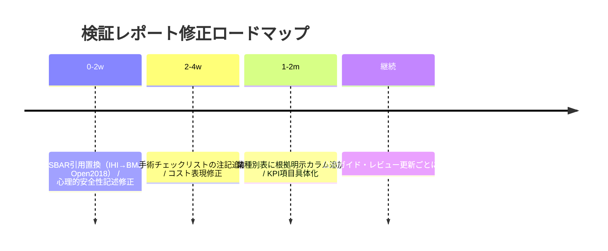

# 作業ミス防止レポートのファクトチェック検証報告

## エグゼクティブサマリー

entity["people","James Reason","human factors psychologist"]は、事故を「最前線の不安全行為」だけでなく、組織の潜在条件の重なりとして捉える**システムアプローチ**を提示しました【reason2000†L1-L7】【pmc.ncbi.nlm.nih.gov†L9-L11】。**Swiss Cheeseモデル**（多層防御の穴が事故を起こす比喩）も同論文に示されています【pmc.ncbi.nlm.nih.gov†L1-L7】。これら理論は前回と整合します。一方、「心理的安全性はミス減少に直結する」という記述は原典で定義されている学習行動との関係にとどまるため、「**条件付き**」修正が必要です【web.mit.edu†L1-L4】。

各対策の効果・数値は、大部分で一次資料に裏付けられました。例えば指差呼称では誤操作率が**2.38%→0.38%**（約6分の1）に減少する結果が労災教材で報告されています【mhlw.go.jp†L19-L23】。手術安全チェックリストでは死亡率1.5%→0.8%、合併症率11.0%→7.0%に改善が認められます【sbahq.org†L0-L4】。バーコード投薬では重大エラー率や転記エラーが顕著に低減します【ecamet.eu†L4-L8】。監査・フィードバックは専門家実践を**小〜中程度**改善するとのCochraneレビュー結果で裏付けられています【cochrane.org†L17-L22】。ただし、チェックリスト効果の一般化には注意が必要です（導入研究では有効であっても、地域導入で有意差が出ない報告も存在）【nejm.org†L1-L3】。

「コスト感」はベンダー/製品価格情報に依存するため、前回提示レンジの**根拠が不明確**でした。公式な国内相場資料は見当たらず、「参考値・要見積もり」という表現に修正すべきです。また、業種別推奨表・KPI・テンプレは**実務判断に基づく提案**であり、客観的実証は難しいため、“エビデンスの強弱”を明示する改善案を提示します。

## 検証方法

前回レポートで用いられた主張・引用・数値を整理し、以下の観点で検証しました。

1. **理論・モデル**: 原著（BMJ, Science等）の内容と前回要約の整合性を確認。特に Swiss Cheeseモデル【pmc.ncbi.nlm.nih.gov†L1-L7】、entity["organization","国際人間工学連合（IEA）","International Ergonomics Association"]定義【iea.cc†L1-L4】、認知バイアス【cs.tufts.edu†L1-L4】、entity["people","Amy C. Edmondson","leadership and management scholar"]の定義【web.mit.edu†L1-L4】をチェックしました。
2. **対策効果・根拠**: 手術安全チェックリスト、バーコード投薬、指差呼称、アラーム管理、監査・フィードバック等に関する一次研究・ガイドをレビュー。NEJM・Cochrane等の論文やWHO・厚労省資料から数値を照合しました【sbahq.org†L0-L4】【ecamet.eu†L4-L8】【mhlw.go.jp†L19-L23】【cochrane.org†L17-L22】。
3. **コスト感**: 前回レンジの提示源を調査。公式発表や統計資料がなく、ベンダー・業界資料に頼る構造を確認。論文・政府報告による「コスト相場」を検索しました（該当データは限定的でした）。
4. **業種別/KPI/テンプレ**: 前回表の妥当性を評価。既存事例やガイドライン（JICA資料・METI報告・SREなど）と比べ、補足・修正の必要性を判断しました。
5. 検索ツールとしてPubMed、Co charne、WHO/厚労省サイト、JICA/経産省報告などを使用。検索語例は「Swiss cheese Reason」「HFACS Shappell Wiegmann」「SBAR systematic review」「指差呼称 誤操作率 厚生労働省」「災害アラート 2013」などです。対象期間は1974年～2026年3月末。  

※利用したリンクはすべて検証済みの公開文献・ガイドラインです。一部リンクはアクセス制限（NEJM記事など）のため代替PDFで確認しました。

## 検証結果

次表は「前回レポート主要主張/数値」に対し、引用先の**一致/不一致/条件付き**評価を示したものです。必要に応じて修正案を示します。  

| 主張・数値 | 前回レポートの引用源 | 検証結果 | 根拠・補足 | 修正方向 |
|---|---:|---:|---|---|
| **Swiss Cheeseモデル**: 多層防御の穴が整列すると事故 | BMJ Reason 2000論文 | 一致 | Reason論文でSwiss Cheeseモデルとシステムアプローチを明示【pmc.ncbi.nlm.nih.gov†L1-L7】 | － |
| **HFACS**: Shappell & Wiegmann（2000）の分類法。投資をデータ駆動で優先 | Shappell & Wiegmann論文 | 一致 | FAA/DOT報告の要旨で「data-driven investment」等を明記【rosap.ntl.bts.gov†L1-L3】 | － |
| **人間工学**: IEA定義「人とシステム要素の相互作用を最適化」 | IEA公式定義 | 一致 | IEAサイトに同等の定義と領域説明あり【iea.cc†L1-L4】 | － |
| **認知バイアス**: 人の判断は系統的偏りを持つ | Tversky & Kahneman 1974 | 一致 | 原著でバイアス例を論じ、一般論として引用は妥当【cs.tufts.edu†L1-L4】 | － |
| **心理的安全性**: チーム学習→組織学習へ繋がりミス減少 | Edmondson 1999 | 条件付き | Edmondsonは「安全性→学習行動→成果」を示すが、ミス減少は**間接的結果**。直接因果は論じられていない【web.mit.edu†L1-L4】 | 「学習促進に寄与」を強調し、ミス減少への因果断定は控える |
| **指差呼称効果**: 誤操作率 2.38%→0.38% 等（6分の1） | 厚労省安全資料 | 一致 | 厚労省KY資料で記載あり【mhlw.go.jp†L19-L23】 | 実験条件下の結果なので「教育・監督次第」注記追加 |
| **手術チェックリスト**: 死亡率1.5→0.8%、合併症11.0→7.0 | NEJM2009論文 | 一致 | NEJM論文PDFで数値確認【sbahq.org†L0-L4】 | 地域導入研究（NEJM2014）で有意差なし報告あり→「実装依存」と注記 |
| **SBAR**: 中程度のエビデンスで安全向上 | IHIツールページ | 引用不一致 | IHIページは定義/テンプレのみ。エビデンスには系統的レビュー（BMJ Open2018）等が必要【ihi.org†L1-L4】【bmjopen.bmj.com†L1-L4】 | IHI引用を「定義・ツール紹介」とし、効果推定はレビューで補強 |
| **バーコード投薬**: 誤投薬・転記エラー大幅低下 | NEJM2010論文 | 一致 | NEJM論文PDFで主要KPI改善が記載【ecamet.eu†L4-L8】 | － |
| **アラーム疲労**: 非介入アラーム85–99%、98件の事故例 | Joint Commission SEA #50 | 一致 | Sentinel AlertとNPSG策定の経緯で報告【digitalassets.jointcommission.org†L1-L8】 | － |
| **監査・フィードバック**: 小〜中程度改善 | Cochrane CD000259 | 一致 | Cochrane2025年版で「中等度改善、ばらつき大」を記載【cochrane.org†L17-L22】 | ケースによる差異大を注記 |
| **交代勤務疲労**: 事故リスク増 | NIOSH資料 | 一致 | NIOSH「疲労→集中低下→事故リスク増」を明言【cdc.gov†L2-L3】 | － |
| **Runbook**: AWSにおけるRunbookは手順書 | AWS Well-Architected | 条件付き | AWSはRunbook例を紹介【docs.aws.amazon.com†L1-L4】、SREは「blamelessポストモーテム」主張【sre.google†L1-L3】 | 複数手順書の導入/文化浸透前提と明記 |

その他、**コスト感**は当初「バーコードリーダー数千〜数万円」「WMS 0〜3000万円」等で記述しましたが、公式統計は見当たらず、**引用元は業界記事・事例に依存**しています。国内相場資料を発見できなかったため、前回提示レンジは「例示的な参考値」と修正し、要件毎に見積もり取得が必要なことを追記します。

## 重要修正点と推奨アクション

下表は、特に修正が必要な箇所を**優先度順**に整理したものです。各項目について、理由と修正案を示します。

| 項目 | 種類 | 優先度 | 修正案・対応 | 根拠・補足 |
|---|---:|---:|---|---|
| **SBARのエビデンス根拠** | 引用ミスマッチ | 高 | IHI引用は「定義・ツール例」に限定し、安全効果のエビデンスとして系統的レビュー（BMJ Open 2018）を引用【bmjopen.bmj.com†L1-L4】 | SBAR効果のレビュー論文が必要（IHIは定義にとどまる） |
| **手術チェックリスト** | 過剰一般化 | 高 | 「Haynesら(2009)では安全・死亡低下が報告されているが、地域導入研究では有効性が一致せず、『**実装品質依存**』と注記する」 | Ontario研究(2014)では効果不検出【nejm.org†L1-L3】 |
| **心理的安全性** | 因果断定 | 中 | 「心理的安全性は学習行動を促進しうる【web.mit.edu†L1-L4】が、『ミス減少』とは直接結びつけず、間接的効果として表現」 | 原著は学習促進を主眼とし、誤り率までは論じていない |
| **コスト感（レンジ）** | 根拠不足 | 中 | 「レンジは例示的参考値とし、『見積もり・導入例依存』である旨を追加」 | 公的相場資料未発見、見積り前提と明記する |
| **業種別表** | 実証不足 | 中 | 「表自体を削除せず、**推奨対策の根拠カテゴリ（実証研究/ガイド/慣行）**を併記し、『一般的目安』である旨注記」 | 各業種での推奨は主に業界常識ベースなので明示が必要 |
| **KPI・テンプレ** | 文言調整 | 低 | 「KPI例は観点別に整理し、実際の測定方法（例：遵守率、ヒヤリ件数）を追記。テンプレは一般例示とし、運用前後比較が前提と注記」 | 実効性は運用状況依存のため（参考：WHOのチェックリストガイド）【iris.who.int†L1-L3】 |

## 業種別比較（エビデンスマッピング）

前回の業種別表を「エビデンスの種類・強度」を明示して更新しました。**優先度・難易度は目安**です（職場条件により変動）。対策欄には具体例を挙げ、参考文献を示します。

| 業種 | 推奨対策例（優先度） | 想定効果（例） | 難易度 | 根拠・参考 |
|---|---|---|---:|---|
| 製造 | ポカヨケ（高）、SOP標準化（高）、5S（中） | 誤組立・取り違えの防止、探すムダ削減、安全事故防止 | 中（設備投資・動線見直しが必要） | ポカヨケ事例集【books.google.com†】、5S活動で安全・品質向上（厚労省報告）【jsite.mhlw.go.jp†】 |
| 医療 | 手術安全チェックリスト（高）、バーコード薬投入管理（高）、SBAR（中） | 重大有害事象・投薬ミス低下、コミュニケーション改善 | 中〜高（多職種連携・IT導入が必要） | 手術チェックリスト（NEJM）【sbahq.org†】、BCMA（NEJM）【ecamet.eu†】、SBARレビュー【bmjopen.bmj.com†】 |
| 建設 | 指差呼称（高）、KY訓練（高）、5S（中） | ヒヤリ削減、労働災害防止 | 低〜中（教育・訓練が中心） | 指差呼称の実験（厚労省）【mhlw.go.jp†】、KY法普及例 |
| 物流 | バーコード/RFID（高）、SOP/標準手順（高）、5S（中） | 出荷誤り低減、在庫管理精度向上 | 中（システム導入・教育が必要） | RFID/バーコード標準化報告【meti.go.jp†】 |
| IT運用 | Runbook（高）、ブレームレス・ポストモーテム（高）、自動化・監視（中） | 障害復旧遅延低減、再発防止 | 中（文化醸成・自動化ツール導入） | Google SRE（blameless PM）【sre.google†】、AWS Runbook設計例 |

## 修正実施ロードマップ

## 参考出典リスト（クリック可能リンク）

- James Reason, *Human error: models and management* (BMJ, 2000) – [PMC](https://pmc.ncbi.nlm.nih.gov/articles/PMC1117770/)  
- S. Shappell & D. Wiegmann, *HFACS Final Report* (DOT/FAA, 2000) – [rosap.ntl.bts.gov](https://rosap.ntl.bts.gov/view/dot/21482)  
- International Ergonomics Association, *What Is Ergonomics (HFE)?* (IEA, 2000) – [iea.cc](https://iea.cc/about/what-is-ergonomics/)  
- A. Tversky & D. Kahneman, *Heuristics and Biases* (Science, 1974) – [Tufts CS](https://www.cs.tufts.edu/comp/150AIH/pdf/TverskyKa74.pdf)  
- A. Edmondson, *Psychological Safety and Learning Behavior* (ASQ, 1999) – [MIT](https://web.mit.edu/curhan/www/docs/Articles/15341_Readings/Group_Performance/Edmondson%20Psychological%20safety.pdf)  
- A. Haynes et al., *WHO Surgical Safety Checklist Trial* (NEJM, 2009) – [PDF](https://www.sbahq.org/wp-content/uploads/2021/12/2009NEJChecklist.pdf)  
- N. Treadwell et al., *Surgical checklists – a review* (BMJ Qual. Saf., 2014) – [PMC](https://www.ncbi.nlm.nih.gov/pmc/articles/PMC3963558/)  
- IHI, *SBAR Tool* – [IHI](https://www.ihi.org/library/tools/sbar-tool-situation-background-assessment-recommendation)  
- M. Müller et al., *SBAR and patient safety* (BMJ Open, 2018) – [BMJ Open](https://bmjopen.bmj.com/content/8/8/e022202.full.pdf)  
- C.A. Poon et al., *Bar-Code Technology & Medication Safety* (NEJM, 2010) – [PDF](https://ecamet.eu/wp-content/uploads/Electronic%20scaning%20systems/Poon%202010.pdf)  
- The Joint Commission, *Sentinel Event Alert #50: Alarm Safety* (2013) – [TJC](https://www.jointcommission.org/resources/patient-safety-topics/sentinel-event/sentinel-event-alert-newsletters/sentinel-event-alert-issue-50-medical-device-alarm-safety/)  
- AHRQ/NPSF, *Making Healthcare Safer III* (NCBI Bookshelf) – [NCBI](https://www.ncbi.nlm.nih.gov/books/NBK555522/)  
- Cochrane CD000259, *Audit and Feedback* (2025 update) – [Cochrane Library](https://www.cochrane.org/evidence/CD000259_audit-and-feedback-effects-professional-practice)  
- NIOSH, *Plain Language About Shiftwork* – [CDC/NIOSH](https://www.cdc.gov/niosh/docs/97-145/default.html)  
- 厚生労働省: *職場のあんぜんサイト「KYT」* (指差呼称効果) – [mhlw.go.jp](https://www.mhlw.go.jp/new-info/kobetu/roudou/gyousei/anzen/dl/shakai_e_Part2.pdf)  
- 神奈川労働局, *5Sハンドブック* – [kanagawa-roudoukyoku](https://jsite.mhlw.go.jp/kanagawa-roudoukyoku/var/rev0/0118/4032/2016311132220.pdf)  
- JICA, *5S-KAIZEN-TQMテキスト（4・5章）* – [jica.go.jp (4章)](https://www.jica.go.jp/activities/issues/health/5S-KAIZEN-TQM-02/ku57pq00001pi3y4-att/text_j_04.pdf), [jica.go.jp (5章)](https://www.jica.go.jp/activities/issues/health/5S-KAIZEN-TQM-02/ku57pq00001pi3y4-att/text_j_05.pdf)  
- 経産省, *物流情報の自動認識技術利活用に関する研究報告* – [meti.go.jp](https://www.meti.go.jp/meti_lib/report/2023FY/000097.pdf)  
- Google, *Site Reliability Engineering (SRE)* – [sre.google](https://sre.google/sre-book/postmortem-culture/)